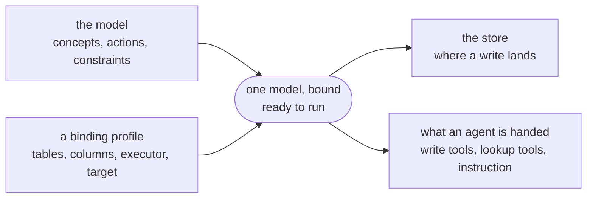

# Modeling write operations

A semantic model says what the data means, and its metrics say what can be read
from it. An **action** is the write-side counterpart: a named operation that
changes state, declared over the same concepts as everything else in the model.

An action does not contain the write. It names the operation, types the
operation's inputs against the ontology, and says which concepts the call
changes. It also points at the **executor** that performs it — an MCP tool, a
REST endpoint, a gRPC method, or DML — which is the one physical part of an
action, and so may come from a binding profile rather than the model. Publishing
it puts the operation in the same place as the data it acts on, so an agent that
discovers the model discovers what it can do as well as what it can ask.

Two files decide everything below. The model says what the operation is; a
binding profile says where it runs. Together they make one runnable thing,
and everything a caller or an agent gets is derived from them:



Nothing is written twice: each key appears in one of those two files, and
everything else is derived from it.

## When to use it

Declare an action when your organization already has an operation that changes
the data this model describes, and you want that operation described where the
data is described. Anything reading the model then knows the operation exists,
what it takes, and where it lives.

An action does not answer a question about the data. Use a
[metric](README.md#1-author-the-logical-model) for that.

## 1. Declare the action

Actions sit at model level, beside metrics, and each one carries a name, an
executor, and its parameters:

```yaml
version: "0.2.0.dev0/google"    # `actions` is a kcmd extension key
semantic_model:
  - name: payments
    entities:
      - name: Account
        description: A customer's money at this bank.
        primary_key: [accountId]
        source: my-project.bank.account
        fields:
          - { name: accountId,      datatype: Integer, expression: account_id }
          - { name: name,           datatype: String,  expression: name }
          - { name: balance,        datatype: Float,   expression: balance }
          - { name: minimumBalance, datatype: Float,   expression: minimum_balance }
          - { name: status,         datatype: String,  expression: status, description: "open, frozen or closed." }
      - name: Transfer
        description: One movement of money between two accounts.
        primary_key: [transferId]
        source: my-project.bank.transfer
        fields:
          - { name: transferId, datatype: Integer, expression: transfer_id }
          - { name: amount,     datatype: Float,   expression: amount }
          - { name: debitedId,  datatype: Integer, expression: debited_account_id }
    relationships:
      - name: TransferDebits
        from: Transfer
        to: Account
        from_columns: [debitedId]
        to_columns: [accountId]
    actions:
      - name: TransferFunds
        description: Move money from one account to another.
        executor:                             # exactly one kind: mcp / rest / grpc / sql
          mcp:
            server: //agentregistry.googleapis.com/projects/acme-ops/locations/us-central1/mcpServers/payments
            tool: transfer_funds
        parameters:
          - { name: source, type: Account }   # an entity: an object reference
          - { name: target, type: Account }
          - { name: amount, type: Float }     # a scalar: an ordinary value
        ai_context:
          instructions: >-
            Resolve both accounts before calling. Name the account the money
            leaves as `source`.
    ai_context:                             # model level: true of every caller
      instructions: >-
        Never move money between two accounts held by the same customer
        without saying so in your answer.
```

The rest of the model — the deployment target, the entity bindings, the
relationships — is authored as it is for any model; see
[Deploying a semantic model](README.md).

The executor says where the operation lives. `mcp` (`{server, tool}`) references
a tool already registered in Agent Registry by the server's resource name plus
the tool's name within it. `rest` (`{endpoint, method}`) and `grpc`
(`{service, method}`) are the other two remote kinds. A fourth, `sql`, carries
the write itself rather than a pointer to whoever performs it — see
[Writing the statements in the model](#writing-the-statements-in-the-model).
Exactly one kind, where an executor is written at all.

`description` and `ai_context.instructions` are both carried through to the
catalog. Write the instructions for the agent that will call the action, as
above.

### The executor is a binding, and may come from a profile

Everything else an action declares is logical — what it takes, what gates it,
what it changes. The executor is not: it is *how* the change is carried out,
which depends on the store. Where the rows sit in a relational database the
write is DML; where they do not, it is a call to whoever owns them. Even two
relational stores differ, each with its own table names and dialect.

So the executor is a physical binding, like an entity's `source`, and a [binding
profile](profiles.md) may supply or replace it:

```yaml
# commerce.profiles/operational.yaml — this store owns the rows, so it writes them
semantic_model:
  - name: payments
    actions:
      - name: TransferFunds
        executor:
          sql:
            statements:
              - UPDATE account SET balance = balance - @amount WHERE account_id = @source
              - UPDATE account SET balance = balance + @amount WHERE account_id = @target
```

An action the profile does not mention keeps whatever the model declared, so the
executor written above serves as the default and a profile overrides only the
stores that perform the write differently. `executor: null` in a profile
withdraws it — a read-only binding that performs no writes at all.

Writing no executor anywhere is allowed. The action is then **declared but not
performable**: it still states what it does, what gates it, and what it changes,
which is the whole of what a reader needs. A catalog-only push (`--no-profile`,
or a model with no deployment target) publishes it like any other action.
`kcmd profiles` lists it under `cannot run:` for each binding that supplies no
executor for it.

A push that also deploys a graph is different, and in the same way it already is
for metrics: the catalog entries reflect the binding that was pushed, pruned to
what it can do. An action that binding cannot perform is absent from them, and
because the model owns its action entries for delete reconciliation, pushing
that binding removes an entry an earlier push published. Choose the binding
whose view of the model the catalog should hold — `default_profile` in
`catalog.yaml` — as you would for a metric only one store can answer.

### What an entity-typed parameter adds

A hand-written tool schema can say that an input is an integer or a string. A
parameter typed against the model says what the input *denotes*:

> **A parameter typed by an entity is an object reference.**

`{name: source, type: Account}` says the argument names an account, so a
consumer generating a tool schema knows to accept an identifier and resolve it
against `Account`'s key rather than pass a number through. A parameter typed by
a scalar datatype, such as `amount` above, is an ordinary value.

### Writing the statements in the model

The three kinds above name a system that performs the write, so what the write
does is opaque to the model: it states an `affects` list and nothing can check
that list against reality. The fourth kind, `sql`, contains the write instead.

```yaml
      - name: TransferFunds
        executor:
          sql:
            statements:
              - UPDATE account SET balance = balance - @amount WHERE account_id = @source
              - UPDATE account SET balance = balance + @amount WHERE account_id = @target
        parameters:
          - { name: source, type: Account }
          - { name: target, type: Account }
          - { name: amount, type: Float }
        affects:
          - { concept: Account, operation: modify, fields: [balance] }
```

#### The statements are written in database names

Look closely at what those statements say. The entity is `Account` and its field
is `accountId`, but the statement writes `account` and `account_id` — the table
and the column that entity is *bound* to, back in `source` and `expression`.

A model gives everything two names, and a metric is written in the first of them:
you write `Account.balance`, and `kcmd` translates it to `account.balance` before
any SQL reaches the store. **An action's statements are not translated.** They
are handed to the store exactly as written, so every table and column in one
must be the database's own name. The only model names in a statement are the
`@parameter` references, which name the action's declared parameters.

That is the price of carrying the write verbatim: a rewrite is a place where
what runs and what was reviewed could come apart.

Nothing catches a model name before the call. Validation checks that each
statement is one DML verb, contains no `;`, and binds only declared parameters —
it never asks the store whether a table exists. A model name therefore fails at
run time, from the store, and the message is not always legible: an entity named
`Order` bound to a table named `Orders` produces

```
Syntax error: Unexpected keyword ORDER [at 1:8]
```

rather than "no such table", because `ORDER` is a reserved word.

Containing the write buys three things a pointer cannot:

- **The blast radius is checkable.** `affects` can be read against the
  statements rather than taken on trust.
- **A guard becomes a real gate.** An MCP, REST or gRPC call commits inside a
  system `kcmd` does not control, so a check wrapped around it is advisory. A
  statement runs in the caller's own transaction and can be rolled back.
- **The gate sees the write.** The statements run where the constraints are
  probed, so a check observes the uncommitted result of the write it is gating.

The narrowness is what makes that safe, and push enforces it:

- Each statement is a **single `INSERT`, `UPDATE` or `DELETE`**. A statement that
  reads is a query and belongs in a metric; one that reshapes the schema is not
  an action. A `;` inside a statement is rejected, because each list entry runs
  on its own and anything after the separator would silently not run.
- Every value arrives as a **bound `@parameter`** naming a parameter the action
  declares. Nothing is interpolated into the statement text, so an argument
  cannot become SQL.
- There is no control flow, and no statement composed at call time. An action
  whose body arrives with the call declares nothing, and a gate cannot check what
  was never declared.

An action that **creates** a row needs a key for it, and the key cannot come from
the caller: an agent that picks its own primary keys can overwrite an existing
row by choosing one that is already taken. Declare the creation in `affects` and
refer to the generated key as `@new<Concept>Key`:

```yaml
        executor:
          sql:
            statements:
              - >-
                INSERT INTO transfer (transfer_id, amount, debited_account_id)
                VALUES (@newTransferKey, @amount, @source)
        affects:
          - { concept: Transfer, operation: create }
```

A `sql` executor is the only kind `kcmd` itself runs — see
[Run it](#7-run-it). The other three are published and dispatched by whoever
reads the model.

## 2. Gate it with a constraint

A **constraint** is a named rule a model states over its ontology. Declaring one
adds it to the catalog and changes nothing by itself. A constraint takes effect
where something references it and nowhere else, so publishing a rule cannot
silently start refusing calls that succeeded yesterday.

Four stages, and a rule that stops at the first one does nothing:

```
  declared                referenced             checked            a breach
  ─────────────────       ─────────────────      ──────────────     ───────────
  constraints:            actions:               a query settles    reject
    - name: X       ──▶     - name: Y      ──▶   an expression; ──▶ escalate
      expression: …           guards: [X]        a language model   warn
      or judgment: …                             a judgment

  a rule in the           the only thing that    when it runs       on_violation
  catalog, inert          gives it effect        follows from       names one of
                                                 what it reads      the three
```

An expression over stored data states a condition the data must satisfy:

```yaml
    constraints:
      - name: BalanceStaysPositive
        expression: Account.balance >= Account.minimumBalance
        description: >-
          An account cannot be taken below its minimum balance.
```

On its own that is a catalogued rule and no more. Nothing consults it, and no
write is refused for breaking it. It acquires effect when an action names it.

An expression that reads an action's **parameters** describes one call rather
than the stored data. The only moment it can be checked is before that call
runs:

```yaml
    constraints:
      - name: AmountIsPositive
        expression: amount > 0
        description: >-
          A transfer must move at least one unit. Ask the caller for the
          amount again before retrying.
    actions:
      - name: TransferFunds
        executor:
          mcp:
            server: //agentregistry.googleapis.com/projects/acme-ops/locations/us-central1/mcpServers/payments
            tool: transfer_funds
        parameters:
          - { name: source, type: Account }
          - { name: target, type: Account }
          - { name: amount, type: Float }
        guards: [AmountIsPositive]
```

`guards` holds the names of constraints the same model declares, and it is how a
constraint acquires effect over an action. Both kinds of rule belong there. One
that reads the action's parameters has no other moment to run. One over stored
data, named as a guard, states that the call must leave the data sound.

When a guard runs follows from what its expression reads, and the model never
states it. A rule over the action's parameters is settled before any statement
runs, since the arguments are the whole of what it reads. A rule over stored
data is a condition on the state a write produces, so it runs after the
statements and inside the same transaction, and a breach rolls that write back.
The difference is derived from the expression rather than authored, so a rule
stays one sentence whether it decides the call or its result.

A rule over stored data is asked only of the rows the call names, and of every
one of them. `TransferFunds` takes two `Account` parameters and writes both, so
a rule over `Account` is asked about the source and the target together. Scoping
it to the first of the two would report the rule as checked while letting
through the write that breaks the second.

Whatever dispatches the call is what checks its guards. Handing a rule to the
store instead works only for some rules. A condition on a single row lowers to a
store-level `CHECK`. One that aggregates across a child table, such as an order
total matching the sum of its line items, lowers to neither Spanner nor
BigQuery.

The reference lives on the action rather than on the constraint, because the
same rule may gate `TransferFunds` and leave `CloseAccount` alone.

`guards` and `on_violation` are independent, as the two right-hand columns
above are: one says when the constraint is checked, the other what a breach
does. Guarding a constraint that declares `warn` is therefore a real shape: it
is how a rule the organization is not yet ready to block on still gets checked
at the moment of the call and reported back.

### When no expression decides it

Some rules a business enforces cannot be written as a boolean. Whether a credit
memo explains the failure it claims to refund, whether a discount is justified
by the reason given — a query can read the text and cannot settle the question.
Such a rule goes in `judgment` instead of `expression`:

```yaml
    constraints:
      - name: CreditMemoNamesAServiceFailure
        judgment: >-
          LineItem.memo must name a specific, verifiable service failure on the
          order: a late delivery, a damaged item, a shipping charge applied in
          error. A memo that states only that the customer requested a credit
          does not satisfy this rule.
        description: >-
          Say what went wrong with the order in the credit memo.
        on_violation: warn
        severity: low
```

A constraint declares one body or the other, never both and never neither. A
judgment must state `on_violation`, and it may state any of the three words.
Leaving the key out is the one thing it may not do: an unmarked constraint
rejects, and that is too strong a consequence to inherit by silence.

### Writing a judgment

A language model reads the sentence at review time with the proposed write in
front of it. Five habits make that reading consistent.

**State what must be true of the data.** Write the condition — *the memo must
name a specific service failure* — rather than the procedure — *check whether
the memo is specific*. The sentence describes a clean write, and everything
about handling a breach lives elsewhere.

**Name fields model-qualified.** Write `LineItem.memo` rather than "the memo".
`kcmd` resolves every `Entity.field` token in the text against the model and
fails the push when the entity declares no such field, so a rename cannot leave
the sentence pointing at nothing. The qualified name also tells the judge
exactly which value to read.

**Say what does not count.** A rule with no negative example is graded against
whatever the model guesses the author had in mind. "A memo that states only that
the customer requested a credit does not satisfy this rule" buys more
consistency than any further description of what a good memo is.

**Leave the consequence out of the prose.** What happens on a breach is
`on_violation`. A judgment ending "…otherwise escalate to a supervisor" states a
routing nothing reads, and the engine routes by the field regardless.

**Keep it to one condition.** When the sentence needs "and also", the second
half is a second constraint. One `on_violation` cannot carry two consequences,
so two conditions that end differently cannot share a constraint.

### A policy whose rules end differently

Real policies have several rules, and the rules rarely end the same way. Take
the policy governing a customer-service credit, stated the way a business states
it, with the two things the model has to settle about each rule beside it:

```
  the business rule                        written as   a breach
  ──────────────────────────────────────   ──────────   ────────
  1  no credit above the order's total     expression   escalate
  2  over 25 dollars needs a supervisor    expression   escalate
  3  the total equals the line items       expression   reject
  4  the memo names a service failure      judgment     warn
  5  not one credit split to evade review  judgment     reject
```

Five rules, three outcomes, two that no query settles. The model has an `Order`
with a `total`, a `LineItem` with an `amount` and a `memo`, and an `IssueCredit`
action taking the order, the amount and the memo. Each rule becomes one
constraint, carrying its own outcome in its own `on_violation`:

```yaml
    constraints:
      # Rules a query can compute.
      - name: CreditWithinOrderTotal              # rule 1
        expression: amount <= Order.total
        description: >-
          A credit cannot exceed the total of the order it credits. Lower the
          amount, or split it across the orders it actually covers.
        on_violation: escalate
        severity: high

      - name: CreditUnderSelfServiceLimit         # rule 2
        expression: amount <= 25
        description: >-
          A credit over 25 dollars is above the self-service limit. A
          supervisor decides it.
        on_violation: escalate
        severity: medium

      - name: OrderTotalMatchesLineItems          # rule 3
        expression: Order.total = SUM(LineItem.amount)
        description: >-
          An order's total must equal the sum of its line items, with credits
          subtracted.
        on_violation: reject
        severity: critical

      # Rules no query can compute.
      - name: CreditMemoNamesAServiceFailure      # rule 4
        judgment: >-
          LineItem.memo must name a specific, verifiable service failure on the
          order: a late delivery, a damaged item, a shipping charge applied in
          error. A memo that states only that the customer requested a credit
          does not satisfy this rule.
        description: >-
          Say what went wrong with the order in the credit memo.
        on_violation: warn
        severity: low

      - name: CreditIsNotSplitToAvoidReview       # rule 5
        judgment: >-
          A credit must not appear to be one larger credit divided into parts
          that each stay under the 25-dollar self-service limit. Read the
          proposed amount together with the other credits already on the same
          Order: several near-limit credits raised close together for related
          reasons are one credit, whatever each memo says on its own.
        description: >-
          Raise this as a single credit for the full amount and send it for
          supervisor review.
        on_violation: reject
        severity: critical

    actions:
      - name: IssueCredit
        executor:
          mcp:
            server: //agentregistry.googleapis.com/projects/acme-ops/locations/us-central1/mcpServers/commerce
            tool: issue_credit
        parameters:
          - { name: order,  type: Order }
          - { name: amount, type: Decimal }
          - { name: memo,   type: String }
        guards:
          - CreditWithinOrderTotal
          - CreditUnderSelfServiceLimit
          - OrderTotalMatchesLineItems
          - CreditMemoNamesAServiceFailure
          - CreditIsNotSplitToAvoidReview
```

Reading down the `on_violation` column gives the branching that the policy
describes in prose, in a column a search can read.

**Rule 3 is named like the rest, because an unnamed rule does nothing.** It is
the one rule here that nobody in the business may approve: an order whose total
disagrees with its line items is broken rather than unusual, which is why it
says `reject`. That word buys nothing until an action names the rule. Left out
of every `guards` list it would be a rule the catalog records and no call
consults, and the strongest word in the policy would be the one with the least
effect.

Naming it binds the rule to the state the write produces. A rule over stored
data runs after the statements and inside the same transaction, so `IssueCredit`
refuses the credit that *breaks* the agreement, rather than only the one raised
against an order whose books already disagree.

Rule 3 is also where this policy meets the limit of what the runtime lowers.
`SUM` over a child table is a function call, and the expressions that become a
query are comparisons over fields, parameters and literals. Rule 3 is named,
published, and still not checked, and because it says `reject`, a call to
`IssueCredit` is refused rather than run past it.

**Rules 4 and 5 are why the second body exists.** Neither reduces to arithmetic
over `Order` and `LineItem`, and before `judgment` they had nowhere to go but a
policy document nothing links to. Note what stays computable alongside them: the
threshold in rule 2 is arithmetic, so it remains an expression a query settles
and no model call is spent on. Folding rules 2, 4 and 5 into one paragraph of
prose, on the grounds that a model could read all three, would throw that away.

**Rule 5 is a judgment that declares `reject`.** Splitting a credit to evade
review is a rule the business means as unappealable, and no expression detects
it, so the alternative to writing it this way is leaving it out of the model.
The pairing carries a real cost, because a language model can decide two
identical credits differently and `reject` leaves nobody to appeal to. It is
published rather than forbidden, and made findable: every constraint carries a
derived `evaluation` field, which reads `judged` here, so an auditor asking
which unappealable rules a model settles gets an answer from one query.

### Two calls through that policy

Two calls against order 12345, which totals 142 dollars. One is a 30-dollar
credit for a shipping charge billed in error; the other is three 9-dollar
credits raised within the hour, each memo reading some version of "customer
asked":

```
                                  amount=30.00,          amount=9.00 x3,
                                  "shipping charge       "customer asked"
                                   applied in error"
  ──────────────────────────────  ─────────────────────  ─────────────────────
  1  within the order's total     holds                  holds
  2  under the 25-dollar limit    violated ─▶ escalate   holds
  3  total matches line items     holds                  holds
  4  memo names a failure         holds                  violated ─▶ warn
  5  not split to evade review    holds                  violated ─▶ reject
  ──────────────────────────────  ─────────────────────  ─────────────────────
  strictest outcome wins          held for a supervisor  refused, with the
                                                         memo warning reported
```

The supervisor who gets the first call reviews a credit against an order rather
than a SQL diff. The second call is the case the judged rules were added for:
every gate a query can compute lets it through, because the policy is evaded by
staying inside the arithmetic.

When one call violates several guards, the strictest outcome applies: any
`reject` refuses the call; failing that, any `escalate` holds it; failing that,
any `warn` lets it through with the violations reported.

That combination is fixed, and no part of the model states it. It is why an
action can name any number of guards without the author writing how to combine
them. It is also how `forbid` overrides `permit` in Cedar and how a deny wins in
Open Policy Agent, so a policy written this way lowers into either.

An action whose guards are *all* judged loads with a warning. Every gate then
costs a model call, none can lower to a store-level check, and each may decide
two identical calls differently. `IssueCredit` is clear of it: three of its five
guards are expressions.

**Status: a judgment is settled by a model when the caller supplies one.**
`kcmd` parses `judgment`, validates it, publishes it and reads it back, and
publishes a derived `evaluation` field saying whether the rule is
`deterministic` or `judged` so a consumer can select on it. Running the action
with `--judge` puts each judged guard to a language model, which answers whether
the rule holds for that call and says why.

Without the flag there is no judge, and the rule's own `on_violation` decides
what that costs. Rule 4 says `warn`, so a call goes ahead and the rule is
reported as not checked. Rule 5 says `reject`, so `IssueCredit` is refused
before either call reaches a gate.

`kcmd` reports a mismatch from either side. A guard that names no constraint
fails the push. A constraint over parameters that no action names loads with a
warning, because nothing will ever evaluate it. That scan reads expressions
only: a judgment is prose, in which a word matching a parameter name is not a
read of that parameter.

**Status: expression guards are checked.** `kcmd` parses `guards`, resolves each
name, and turns every expression it can into a query against the store. Those
queries run in the same transaction as the write: a rule over the parameters
before the statements, a rule over stored data after them. A violation carries
its own `on_violation` word back to the caller, and several violations combine
by the rule above.

A guard the runtime can settle neither way is what remains: an expression
outside the grammar, such as rule 3's `SUM`, and a judgment on a run that was
given no judge. What happens then follows the rule's own `on_violation`. One
that would `reject` or `escalate` refuses the action, because running it would
apply a write the model says is checked first. One that would `warn` lets the
write through and is reported back as not checked, since an advisory rule stops
nothing even when it is evaluated.

## 3. Say what it changes

An executor is opaque. `mcp: {server, tool}` says where the operation lives and
nothing more — no reader of the model can see what that tool writes. So the blast
radius of a call is declared or it is unknown, and `affects` is where the author
declares it:

```yaml
        affects: [Account, Transfer]
```

That is the coarse form: these concepts are touched, in a way the model does not
spell out. It is enough to answer *which actions can change an account at all*,
which is already more than an executor name answers.

A record says more — which operation, and which fields the call writes:

```yaml
        affects:
          - concept: Account
            operation: modify
            fields: [balance]
          - concept: Transfer
            operation: create
          - concept: TransferDebits
            operation: create
```

The two shapes mix freely in one list, so an author can be precise about the
concepts they know and coarse about the rest. Every `concept` — bare or named
under the key — must be something the same model declares.

### One key for both kinds

`concept` names an entity or a relationship, and the model already knows which.
Asking the author to repeat it would add a second place to get it wrong and
change nothing about what the action affects. `TransferDebits` above is the edge
from the example model; it is written exactly like the two entities beside it.

### The operations

`create`, `modify`, `delete` — the same three whatever the concept is.

An edge is not only attached and detached. A many-to-many relationship is backed
by a junction table with fields of its own, so *modify the grade on an
Enrollment* is as ordinary a change as *modify an order's total*, and a
vocabulary that gave edges only `add` and `remove` could not express it.

`fields` narrows a `create` or a `modify` to the fields the call writes, which is
what makes *which actions can change `Account.balance`* answerable. A `delete`
takes the whole instance, so naming fields beside one is rejected rather than
ignored.

Both the operation and the fields are optional. `- concept: Account` on its own
says the same thing the bare `Account` does, and is written back as the bare
form.

**Status: nothing consumes `affects` yet.** `kcmd` parses it, checks every
concept against the model, publishes it and reads it back. No component computes
an impact from it, routes on it, or checks it against what the executor actually
does.

## 4. Check it before pushing

```bash
kcmd push --validate-only
```

Four things about an action can be statically wrong once the document parses,
and each one is a hard error:

```
action 'TransferFunds' in model 'payments' (payments.yaml) has parameter
'target' whose type 'BankAccount' is neither a known entity nor a scalar
datatype.

action 'TransferFunds' in model 'payments' (payments.yaml) has an mcp executor
whose 'tool' is missing or blank.

action 'TransferFunds' in model 'payments' (payments.yaml) is guarded by
'AmountIsPostive', but model 'payments' declares no constraint of that name.

action 'TransferFunds' in model 'payments' (payments.yaml) affects 'Acount',
which is neither an entity nor a relationship this model declares.
```

A parameter type that resolves to neither an entity nor a scalar means the model
cannot say what that argument denotes, which is the whole contribution an action
makes. An executor missing a coordinate cannot be dispatched by whatever picks
the action up. A guard that names no constraint — `AmountIsPostive` here, a
misspelling of the `AmountIsPositive` declared above — leaves the author
believing the write is checked when nothing checks it. An `affects` entry naming
`Acount` describes a blast radius over a concept that does not exist, so
anything reading it reads about nothing.

The rest of an entry is checked the same way and for the same reason: fields
beside a `delete`, and a field the concept does not declare, are each a hard
error too. An operation outside `create` / `modify` / `delete` never gets this
far — the vocabulary is closed, so the document does not parse at all. All of
these checks are static, so they run on every push whatever the destination.

## 5. Push it

```bash
kcmd push
```

Knowledge Catalog is the only system an action reaches. Every other push target
deploys nothing for it and warns once:

```
Warning: [payments] 1 action(s) reach Knowledge Catalog only; the BigQuery
push deploys none of them.
```

A graph-only `kcmd push --no-kc` therefore validates the actions and then warns
that they will not be deployed.

In Knowledge Catalog, each action becomes its own entry, parented to the model
entry, the same way a metric does. The entry carries one aspect holding the
executor and the typed parameters:

```yaml
# .../entryGroups/<group>/entries/payments.actions.TransferFunds
entryType: projects/<project>/locations/global/entryTypes/semantic-action
parentEntry: .../entryGroups/<group>/entries/payments
entrySource:
  displayName: TransferFunds
  description: Move money from one account to another.
aspects:
  <project>.global.semantic-action:
    executorKind: mcp
    mcpServer: //agentregistry.googleapis.com/projects/acme-ops/locations/us-central1/mcpServers/payments
    mcpTool: transfer_funds
    parameters:
      - {name: source, type: Account, isEntityRef: true}
      - {name: target, type: Account, isEntityRef: true}
      - {name: amount, type: Float, isEntityRef: false}
    affects:
      - {concept: Account, operation: modify, fields: [balance]}
      - {concept: Transfer, operation: create}
      - {concept: TransferDebits, operation: create}
    instructions: Resolve both accounts before calling. Name the account the money leaves as `source`.
```

`affects` is published as the author wrote it and nothing more. Whether
`TransferDebits` is an entity or an edge is not stored: a consumer that needs to
know reads it off the model, which is the only thing that can say so correctly
after a rename.

Removing an action from the document deletes its entry on the next push, because
the model owns the `<model>.actions.` id prefix. A catalog search can list the
actions in a project by entry type, the way it lists entities or metrics.

`semantic-action` is a custom entry type, because Dataplex has no built-in type
for an action yet. `kcmd init --semantic-model` provisions the entry type and
its aspect type in your own project. Run init once before the first push of a
model that declares actions.

Publishing an action needs the permission to attach its aspect, in addition to
the permissions any push needs — see
[Reference → Permissions](reference.md#permissions).

## 6. Pull it back

```bash
kcmd pull
```

Pull collects the `semantic-action` entries under the model entry and rebuilds
each action, so a name, a description, an executor, typed parameters, its
`guards`, its `affects`, and `ai_context.instructions` survive the round trip
unchanged. What every part of a model does and does not survive is in
[What push and pull preserve](fidelity.md).

## 7. Run it

An action with a `sql` executor is a write `kcmd` can perform. Two commands:

```bash
kcmd action list
kcmd action run TransferFunds --arg source="Alice Checking" \
    --arg target=ACC-2 --arg amount=250
```

`kcmd action list` is what the model declares as runnable — parameters,
executor, guards, blast radius — and each entry ends with the command line that
runs it, so reading the listing is enough to make the call:

```
Model 'payments' (payments_eg), profile 'operational':
  store: my-project/my-instance/semantic_agent_demo
  TransferFunds: Move money from one account to another.
    parameters: source (Account, reference), target (Account, reference), amount (Float)
    executor:   sql
    guards:     AmountIsPositive
    affects:    Account (modify), Transfer (create), TransferDebits (create)
    run:        kcmd action run TransferFunds --arg source=<Account> --arg target=<Account> --arg amount=<Float>
```

### How a row is identified

An entity-typed parameter takes an object reference rather than a value, so
`--arg source="Alice Checking"` has to become one specific row before anything
can run. Two separate things decide which rows an action touches, and conflating
them is the easiest way to misread what an action does:

```
              resolving an argument     targeting the write
              ───────────────────────   ──────────────────────────────────
  what        --arg source=             the statement's own WHERE clause
                "Alice Checking"
  who runs    kcmd, before the write    the store, in the transaction
  how many    exactly one row, or       however many rows it matches;
              the call fails            kcmd does not constrain it
  gives       @source = 7               the rows the write lands on
```

**Resolving an argument.** For each entity-typed parameter, `kcmd` runs one
lookup against that entity's table before the write:

```sql
SELECT account_id FROM account
WHERE account_id = @ref0 OR name = @ref LIMIT 2
```

The `WHERE` is built from two things the entity declares:

- **its `primary_key`.** `Account` declares `primary_key: [accountId]`, and
  `accountId` is bound to the column `account_id`, so the input is compared
  against that column. This is the answer to "how does it know which column is
  the key" — the model says so; nothing is inferred from the database. One
  argument cannot name a key of several columns, so an entity keyed that way is
  reachable only through the identifying field below.
- **an identifying text field, if the entity has one.** A `String` field that is
  not part of the key, bound to a plain column, and *named* `name`, `full_name`,
  `title`, `label` or `display_name`. `Account` declares `name`, so
  `"Alice Checking"` and the account id both find the same row. The match is on
  the field's name in the model, not the column's name in the store.

The input is compared against each column as that column's own type, so a key
declared `Integer` is only compared when the input is a number — `"Alice
Checking"` is not, so that predicate is dropped rather than cast. If nothing is
left to compare, no query is sent at all.

Exactly one row must come back. Zero is `No Account matches 'Alice Checking'.`
Two or more is ambiguous, and the candidates are listed by key so the caller can
pick one — a name is not required to be unique, and if two accounts carried this
one:

```
Error: 'Alice Checking' matches more than one Account (7, 12); use a key to
disambiguate.
```

Both are reported rather than guessed at, because both are things the caller can
act on.

**Targeting the write.** Resolution produces a *value*, which the statement then
uses; how many rows that statement lands on is its own `WHERE` clause's
business, and nothing would stop one that hits every dormant account. `affects`
does not limit the blast radius either — it *declares* it, so that a reader
knows what the write is about and an evaluator can one day check the statements
against what was declared.

`kcmd action run` does four things:

```
  kcmd action run TransferFunds --arg source="Alice Checking" --arg amount=250
     │
     │ resolve   SELECT account_id FROM account
     │           WHERE account_id = @ref0 OR name = @ref LIMIT 2
     │           exactly one row, or the call fails         ──▶  7
     │
     │ bind      @source = 7      as Integer, the key's declared type
     │           @amount = 250    as Decimal, so 9 is less than 10
     │
     │ check     SELECT 1 AS violated FROM UNNEST([1])
     │           WHERE NOT COALESCE((@amount > 0), FALSE)
     │           AmountIsPositive, before any statement runs
     │
     │ apply     UPDATE account SET balance = balance - @amount
     │             WHERE account_id = @source
     ▼
   committed  ·  refused  ·  nothing written  ·  unknown, do not retry
```

One transaction spans all four steps, so a guard that finds a violation and a
statement that fails both leave nothing behind. A guard over stored data runs
after the statements rather than before them, where it reads the state the write
produced. The `NOT COALESCE(…, FALSE)` wrapper makes a predicate that returns
NULL count as a breach rather than as silence.

Nothing is interpolated into a statement; every argument is a query parameter
of the store type its declared ontology type implies. Any failure before the
commit rolls back, so no partial write survives, and a commit the store rejects
wrote nothing either. The commonest rejection is Spanner's `ABORTED` under lock
contention, and the answer to it is to run the action again.

**Refused** is the model's answer rather than the store's: a guard was
violated, so the transaction was rolled back and the caller is told which rule
stopped the call. **Unknown** is the outcome `kcmd` cannot settle: a timeout or
a 5xx, where the store may have applied the write and lost the response. It is
reported as unknown rather than as a rollback, because a caller told "nothing
happened" would retry a write that did.

Where the write goes is the model's Spanner deployment target under the selected
profile. The command line never names a database: `--profile` changes the store,
the same rule [push](profiles.md) follows.

Only a `sql` executor runs. An `mcp`, `rest` or `grpc` executor names an
operation in another system, which `kcmd` cannot call and could not roll back if
the commit failed, so it refuses rather than half-perform the write:

```
Error: Action 'TransferFunds' is executed by MCP, which runs outside this
transaction and could not be rolled back if the commit failed. Supply a handler
that performs the write as DML, or declare the action with a 'sql' executor.
```

### What a violated guard does

A violated guard stops the write and answers in the words the constraint's
`description` gives, so the caller reads the policy rather than a predicate.
Both runs below take the credit policy from
[section 2](#a-policy-whose-rules-end-differently) with the two guards this
runtime cannot check left off the action.

A rule that declares `reject` ends the call. The policy as written has no
rejecting rule a query settles, so this run adds one — `CreditAmountIsPositive`,
`amount > 0` — and asks for a credit of nothing:

```
$ kcmd action run IssueCredit --arg order=12345 --arg amount=0 --arg memo="shipping charge applied in error"
Running 'IssueCredit' on projects/my-project/instances/my-instance/databases/semantic_agent_demo...
Refused (reject): Action 'IssueCredit' was refused and nothing was written. A
credit must return at least one cent. Ask the caller for the amount again before
retrying. Stopped by 'CreditAmountIsPositive' (amount > 0).
```

A rule that declares `escalate` ends it the same way and adds what would change
the answer. Taking the 30-dollar credit:

```
$ kcmd action run IssueCredit --arg order=12345 --arg amount=30 --arg memo="shipping charge applied in error"
Running 'IssueCredit' on projects/my-project/instances/my-instance/databases/semantic_agent_demo...
Refused (escalate): Action 'IssueCredit' needs an approval, and nothing was
written. A credit over 25 dollars is above the self-service limit. A supervisor
decides it. Stopped by 'CreditUnderSelfServiceLimit' (amount <= 25). Nothing is
held while somebody decides: the transaction was rolled back, so run the action
again once it is approved.
```

Both exit non-zero, because the caller asked for a write and did not get one.
Neither is reported as an error: the model was consulted and said no, which is
the runtime working. A rule that declares `warn` commits and reports the
violation alongside the commit.

When one call violates several guards the strictest outcome applies, by the
rule [section 2](#two-calls-through-that-policy) states, and every rule that
stopped the call is named in the message rather than only the strictest. A rule
that declares `warn` is not among them: it asks for the write to proceed and be
reported, and a refused call wrote nothing for it to report on.

What makes a rule a guard of this call is `guards`, and only `guards`. A
constraint the action does not name is a rule this call does not consult, and
the runtime does not go looking for one: a constraint that merely reads a
concept the action writes gates nothing, and neither does declaring constraints
in a model whose action leaves `affects` out. Checking either would mean
publishing a rule could start refusing calls that succeeded the day before,
which is what making the reference explicit prevents.

### A guard settled in words

A judgment does not become a query. It is put to a language model, which
answers whether the rule holds for this call and says why. The model is given
four things: the rule as the author wrote it, the action's name, its
description, and the arguments the caller passed. `--judge` is what supplies
one, naming a model or taking the default:

```
$ kcmd action run IssueCredit --judge --arg order=12345 --arg amount=20 --arg memo="goodwill"
Running 'IssueCredit' on projects/my-project/instances/my-instance/databases/semantic_agent_demo...
  rules stated in words go to gemini-2.5-flash (us-central1)
Refused (reject): Action 'IssueCredit' was refused and nothing was written. A
credit needs a stated reason. Say what went wrong on this order. Stopped by
'CreditMemoNamesAServiceFailure' (The LineItem.memo must name a specific service
failure that justifies the credit. A memo that only says the credit is owed, or
names no failure at all, does not satisfy this.). Your memo "goodwill" does not
name a specific service failure that justifies the credit.
```

The message carries three things: the constraint's `description`, which is the
policy; the rule itself, which is what was asked; and the model's own sentence
about this call, which is the part no expression could have written. A memo that
does name a failure passes the same gate:

```
$ kcmd action run IssueCredit --judge --arg order=12345 --arg amount=20 --arg memo="package arrived three days late"
Running 'IssueCredit' on projects/my-project/instances/my-instance/databases/semantic_agent_demo...
  rules stated in words go to gemini-2.5-flash (us-central1)
  order: '12345' -> Order 12345
Committed at 2026-09-14T03:56:47.873503Z.
```

Judged guards are settled before the transaction opens, earlier than any
expression guard. A model call takes seconds, and a read-write transaction held
open across one holds its write locks for that long, so a call the judge refuses
costs the store no session and no lock at all. The price is that a judge sees
the arguments and nothing else: the state the write produced does not exist yet,
so a rule about it has to be an expression.

### A guard the runtime cannot check

Two kinds of guard settle neither way. A judgment on a run given no judge is
one. An expression outside the grammar is the other: the comparisons that
lower are over an entity's stored fields, the action's parameters and literals,
joined by `AND` and `OR`, so a function call or a parenthesised subexpression
does not.

A model that declares a rule and a runtime that quietly ignores it is worse than
no runtime, because the model states the write is checked and nothing says
otherwise. So a rule that would `reject` or `escalate` and cannot be checked
stops the call, and every such rule is named:

```
$ kcmd action run IssueCredit --arg order=12345 --arg amount=20 --arg memo="package arrived three days late"
Running 'IssueCredit' on projects/my-project/instances/my-instance/databases/semantic_agent_demo...
Error: Action 'IssueCredit' cannot be run: constraint 'OrderTotalMatchesLineItems'
cannot be checked: it uses parentheses or a function call (Order.total =
SUM(LineItem.amount)), which the grammar does not parse; constraint
'CreditMemoNamesAServiceFailure' cannot be checked: it is settled by judgment
rather than by an expression, and this runtime was given no judge to ask.
Running it would apply a write the model says is checked first, so it is refused
rather than run unchecked.
```

An advisory rule is the exception. A rule that declares `warn` reports a
violation rather than stopping one, so failing to check it cannot be grounds for
stopping the call either; treating it as one would leave a model that states
advisory rules permanently unrunnable. The write goes ahead and the rule is
reported as not checked, which is the part worth having: a report the model
asked for and did not get is worth knowing about.

```
$ kcmd action run IssueCredit --arg order=12345 --arg amount=20 --arg memo="shipping charge applied in error"
Running 'IssueCredit' on projects/my-project/instances/my-instance/databases/semantic_agent_demo...
  order: '12345' -> Order 12345
  not checked: advisory rule 'CreditMemoNamesAServiceFailure' (constraint
  'CreditMemoNamesAServiceFailure' cannot be checked: it is settled by judgment
  rather than by an expression, and this runtime was given no judge to ask)
Committed at 2026-09-14T04:00:47.677741Z.
```

A rule that cannot be checked is found while the guards are lowered, before any
session is opened, so that refusal leaves no transaction behind.

## 8. Hand it to an agent

An agent needs two things from a model: a way to find what is there, and a way
to change it. The entities already say what can be looked at and the actions
already say what can be done, so neither half is written by hand. One command
prints what an agent would be handed:

```bash
kcmd agent tools
```

Run against the model built up on this page, it prints the listing below.
Reading the model is all it does: it opens no session, calls nothing, and
changes nothing.

```
Model 'payments' (payments_eg), profile 'operational':
  store: my-project/my-instance/semantic_agent_demo

  action  transfer_funds  (TransferFunds)
      Move money from one account to another.

      Resolve both accounts before calling. Name the account the money leaves
      as `source`.

      This call is gated by AmountIsPositive.
      source: string -- Which Account this applies to. Give its key, or text
          that identifies exactly one; the call fails when nothing matches or
          more than one does.
      target: string -- Which Account this applies to. Give its key, or text
          that identifies exactly one; the call fails when nothing matches or
          more than one does.
      amount: number -- The amount, as a number.

  lookup  find_account  (Account)
      A customer's money at this bank.

      Returns accountId, name, balance, minimumBalance, status. Every argument
      is an exact match and every one is optional; giving none returns the
      first rows. This tool cannot join, compare ranges, or total anything.
      accountId: integer
      name: string
      balance: number
      minimumBalance: number
      status: string -- open, frozen or closed.

  lookup  find_transfer  (Transfer)
      One movement of money between two accounts.

      Returns transferId, amount, debitedId. Every argument is an exact match
      and every one is optional; giving none returns the first rows. This tool
      cannot join, compare ranges, or total anything.
      transferId: integer
      amount: number
      debitedId: integer

  instruction:
      Never move money between two accounts held by the same customer without
      saying so in your answer.

      Never invent an identifier. When you are given a name or a description
      instead of one, find it with the lookup tools rather than asking for it
      -- that is what they are for, and asking wastes the caller's time. Never
      compute a total or a balance yourself; the tools do that. When a tool
      reports that a write did not happen, read the reason it gives and repeat
      it plainly; if it says a person has to decide, say so and stop, because
      you cannot approve it yourself. Finish by saying what you changed.
```

That is three things — one **write tool** for the action, one **lookup tool**
for each entity, and one **instruction** for whatever agent holds them. Every
line of it comes from a key in one of the two files, and each key produces one
thing:

```
  the model                              what the agent is handed
  ─────────────────────────────────      ───────────────────────────────────
  actions:
    - name: TransferFunds          ───▶  action  transfer_funds
      description: Move money…     ───▶      Move money from one account to
                                               another.
      ai_context:
        instructions: Resolve…     ───▶      Resolve both accounts before
                                               calling.
      guards: [AmountIsPositive]   ───▶      This call is gated by
                                               AmountIsPositive.
      parameters:
        - name: source
          type: Account            ───▶      source: string -- Which Account
                                               this applies to. Give its key…
        - name: amount
          type: Float              ───▶      amount: number -- The amount, as
                                               a number.

  entities:
    - name: Account                ───▶  lookup  find_account
      description: A customer's…   ───▶      A customer's money at this bank.
      fields:
        - name: accountId
          datatype: Integer        ───▶      accountId: integer
        - name: status
          description: open,…      ───▶      status: string -- open, frozen
                                               or closed.

  ai_context:
    instructions: Never move…      ───▶  instruction:
                                             Never move money between two
                                             accounts held by the same…

  the binding profile                    what the agent is handed
  ─────────────────────────────────      ───────────────────────────────────
  deployment_target                ───▶  store: <project>/<instance>/<db>
  entities[].source                ───▶  the table a lookup reads
  fields[].expression              ───▶  the column it filters on
  actions[].executor               ───▶  what the write tool runs
```

Two things come from neither file. Whether a tool can be called at all is the
runtime's answer rather than a key, and a tool it cannot offer is marked and
carries the reason. The second paragraph of the instruction is the derivation's
own text about using the tools, identical for every model.

Nothing in the listing was written for a particular agent, which is the
property worth being able to see: it reads the same whether the caller is ADK,
LangChain, or a person deciding whether the model says enough yet.

### What the two kinds of tool do

A **write tool** runs the action. Invoking `transfer_funds` performs the same
resolve, bind and transact that [`kcmd action run TransferFunds`](#7-run-it)
performs, with the same argument resolution, the same guards, the same single
transaction and the same four outcomes.

A **lookup tool** reads one entity: exact match on any bound field, combined
with AND, capped at 50 rows. No joins, no ranges, no aggregation, no ordering.
That is enough to turn `"Alice Checking"` into the account id the write tool
needs, and it keeps the generated SQL checkable by eye. Table and column names
come from the binding and every filter value is a bound parameter, so no caller
text reaches the SQL.

A lookup is named for its entity, and an action keeps its own name when the two
collide. An entity `Account` beside an action `FindAccount` both derive
`find_account`: the action takes it, because that name is the author's own, and
the lookup becomes `lookup_account`. Deriving both halves together is what
allows the collision to be noticed at all.

### A tool says whether it can be called

`transfer_funds` above is listed with no caveat. `AmountIsPositive` is an
expression over one of the action's parameters, so the runtime can check it, and
naming it as a guard costs the tool nothing. An action guarded by a rule the
runtime [cannot check](#a-guard-the-runtime-cannot-check) is the other case, and
it is reported here — before any agent exists, rather than inside a
transaction.

The tool is still returned, still named and still described. An action the
model declares should not vanish from what the model offers; what it is waiting
on is the useful thing to print. Both halves carry a `runnable` flag, and
`unavailable` carries the reason:

| A write tool is withheld when | A lookup is withheld when |
|-------------------------------|---------------------------|
| a profile withdrew the executor | the entity is abstract, so it has no table |
| the executor is remote and no handler was supplied | no profile bound it to a table |
| it names a guard this runtime cannot check | its binding is a query rather than a table |
| a parameter references an entity keyed by several columns | |
| the statements ask for a generated key a UUID cannot fill | |

The derivation asks the runtime for that verdict rather than working it out
again, so the two cannot drift. Drift costs something in both directions: a
tool advertised as runnable that refuses every call spends the agent's turn and
teaches it nothing, and one withheld that would have worked is never discovered
at all.

### Calling it from code

`kcmd agent tools` prints the derivation; `modelTools` returns it. Both take a
**semantic runtime**: one model paired with the store the profile binds it to.
`createSemanticRuntimes` assembles them the way `kcmd action` does, so an agent
reads the model the CLI reads, under the same profile, with the same merge and
the same warnings:

```ts
import {createSemanticRuntimes} from './src/libts/semantic/runtime/runtime';
import {modelTools, callableTools} from './src/libts/semantic/runtime/agent_tools';

const runtimes = await createSemanticRuntimes({profile: 'operational'});
if ('error' in runtimes) throw new Error(runtimes.error);

const runtime = runtimes[0];
if (!runtime.store) throw new Error(runtime.storeError);

const {callable, withheld, instruction} = callableTools(modelTools({runtime}));
```

One call returns a runtime for every model document in the entry group. Each
carries the store its deployment target names, the profile it was built under,
and the document it was authored in, so a message about one model can say which
file and which profile produced it.

A store is typed by its backend: `runtime.store.kind` is `'spanner'` or
`'bigquery'`, and only a Spanner store can be written to. A model whose profile
binds no store at all still gets a runtime, with `storeError` saying why. Its
tools are still derived, each marked unavailable for that reason, so an agent
is told what the model offers and why it cannot reach it.

Go through `createSemanticRuntimes` rather than building a client yourself. It
is also the check that every entity is bound to a table in the store the
profile targets, and a lookup derived from a model bound to some other system
would otherwise read whatever table of that name the target store happens to
hold.

`modelTools` returns `{lookups, actions, instruction}` — the three things the
listing printed. `callableTools` then sorts both halves into the ones this
binding can serve and the ones it cannot, which is a split every adapter has to
make and the same split every time. Offer `callable` to the agent, and report
`withheld` rather than hiding it. `actionTools` and `entityTools` are exported
for a caller that wants one half.

Each tool is a name, a description, typed parameters and `invoke(args)`, so
binding one to ADK, to LangChain or to an MCP server is a short adapter over
that shape, and a second framework costs nothing here. Nothing in this module
imports an agent framework.

`invoke` answers with three states rather than two. A write that landed and one
that did not are the obvious pair; the third is a commit whose result nothing
can establish, reported as unknown with an explicit "do not retry", because a
caller reading it as "nothing happened" applies the write twice.

`handler` may be passed for an executor this runtime cannot perform itself. It
is not passed to an action with a `sql` executor. Such an action claims that
what runs is what the catalog published, and one handler serves the whole
model, so passing it through would retract that claim for every such action at
once.

### The instruction is not the agent's to write

The instruction at the foot of the listing has two parts, because two different
people own them.

The first is the model's own `ai_context.instructions` — what this business
asks of anything that acts on it. It belongs to the model because it is true of
every agent that acts on the model, including the ones nobody has written yet.
It also belongs there because a rule an agent keeps in its own source can be
changed without the people who own the model finding out. Agents are replaced
when frameworks change; the model is not.

The second part is about the tools rather than the business: what a lookup is
for, and what a refused write means. The derivation owes that half, because it
describes a contract this module defines and the model never stated. Written
into each agent instead, it is the same paragraph copied into every adapter,
drifting in each one.

So an agent that appends a persona of its own is saying something the model did
not. The place to put it is the model.

### A worked example

`demo/semantic-model/agent/` is an agent built this way, running against a live
operational store: a commerce model, a binding profile, and one file of 56 lines
that names no table, no column and no business term. Thirteen of those lines are
the adapter onto the agent framework. Its README walks the same four steps and
states what the run cannot yet do.

## What is not modeled yet

This is a prototype. Five things a reader reasonably expects are absent.

- **A judge reads only the call's arguments.** A judged guard is settled before
  the transaction opens, so the model sees the rule and the arguments and
  nothing the store holds. A rule needing a stored value cannot be settled that
  way: "not one credit split to evade review" has to see the order's other
  credits. A run given no judge settles such a rule not at all, and the action
  is stopped rather than run past it, unless the rule is advisory.
- **The expression grammar is narrow.** Comparisons over an entity's stored
  fields, the action's parameters and literals, joined by `AND` and `OR`. A
  function call, a subquery or a rule spanning two entities does not lower, and
  the action is stopped rather than run past it. Beyond the guards, the
  correctness of what a statement does belongs to whoever wrote it.
- **A guard cannot ask about the state before the write.** Whether a rule runs
  before the statements or after them is derived from whether it reads a
  parameter, so a condition over stored data alone is always asked of the
  post-state. `Order.status = 'OPEN'` on an action that closes the order is a
  precondition no model can currently express: written as a guard it is checked
  after the close and fails every call. Say it with a parameter the rule can
  read, or leave it to the statement's own `WHERE` clause, until the model has a
  way to name the moment. For the same reason a rule that asks about both at
  once, such as `Order.total >= 0 AND amount > 0`, is refused rather than timed
  as one: a probe runs at a single moment, and checking the stored half against
  the pre-state would let the write that breaks it commit while the rule reports
  as checked. Write one constraint for each and name both in `guards`.
- **`kcmd` calls no executor but its own.** A `sql` action runs; an `mcp`,
  `rest` or `grpc` one is published for whoever dispatches it, which is why
  those three name coordinates rather than a statement.
- **The store is Spanner.** `kcmd action run` resolves, binds and transacts
  against the Spanner database the profile's deployment target names. A model
  bound to BigQuery publishes its actions and runs none of them.
