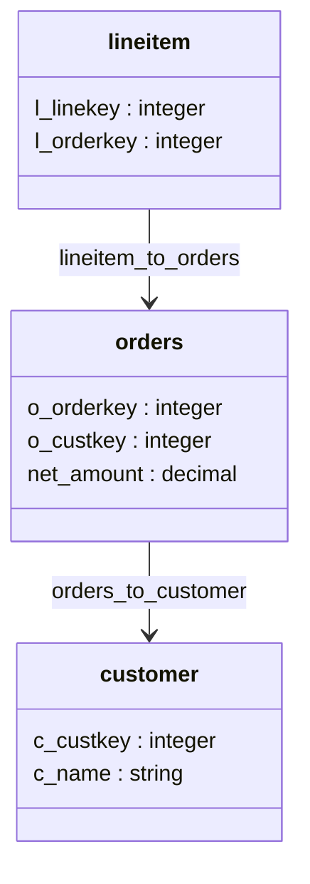
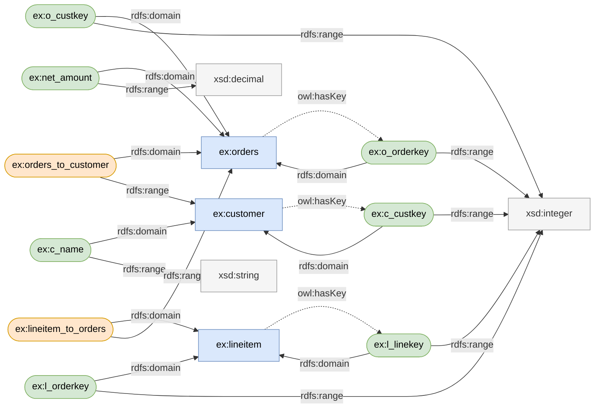

# End-to-end codelab: one semantic model, from authoring to query

A self-contained walkthrough. You author a semantic model, govern it in Knowledge
Catalog, and bind it to physical stores — BigQuery and Spanner — to query it in
each. The model is defined once and every store reads from that single
definition. The expected output is shown after each command so you can check as
you go.

For the deploy mechanics on their own (author, push, update, pull), see the
[deploy guide](README.md); for every flag and permission, see the
[reference](reference.md).

---

## Setup

You need the `gcloud` and `bq` CLIs, and `kcmd` on your `PATH` (build it from
source: see [Build](../../README.md#build)). `kcmd` uses your `gcloud`
configuration for credentials, project, and region:

```bash
gcloud auth application-default login
gcloud config set project <your-project>
gcloud config set compute/region <your-region>
```

The commands below reuse a few names. Set them once for your own project:

```bash
export PROJECT=$(gcloud config get-value project)  # used in table and graph names
export LOCATION=global                              # Knowledge Catalog entry-group location
export DATASET=datacloud_demo                       # BigQuery dataset + KC entry group
export GRAPH=sales                                  # property-graph name
```

---

## 1. Author the logical model

`init` provisions the Knowledge Catalog entry group and a local workspace:

```bash
mkdir -p ~/semantic-model-codelab && cd ~/semantic-model-codelab
kcmd init --semantic-model $PROJECT.$LOCATION.$DATASET
# -> scope: semantic-model.$PROJECT.$LOCATION.$DATASET
```

Author the model in two parts — this is what lets one model serve many stores:

- The **logical model** (this step) declares the business: three entities
  (`orders`, `customer`, `lineitem`), the relationships between them, and one
  metric (`revenue`). It names nothing physical.
- A **binding profile** then says where each entity reads from and which column
  each field is. You write one for each store the model serves, and the logical
  model itself never changes.

### Author by hand

Write the logical model. It declares the entities, their fields, the
relationships between them, and the metric:

```bash
cat > catalog/EntryGroups/$DATASET/sales.yaml <<'YAML'
version: "0.2.0.dev0"
semantic_model:
  - name: sales
    description: Orders, line items, and customers for the codelab
    entities:
      - name: orders
        primary_key: [o_orderkey]
        fields:
          - { name: o_orderkey, datatype: Integer }
          - { name: o_custkey,  datatype: Integer }
          - { name: net_amount, datatype: Decimal }
      - name: customer
        primary_key: [c_custkey]
        fields:
          - { name: c_custkey, datatype: Integer }
          - { name: c_name,    datatype: String }
      - name: lineitem
        primary_key: [l_linekey]
        fields:
          - { name: l_linekey,  datatype: Integer }
          - { name: l_orderkey, datatype: Integer }
    relationships:
      - name: orders_to_customer
        from: orders
        to: customer
        from_columns: [o_custkey]
        to_columns: [c_custkey]
      - name: lineitem_to_orders
        from: lineitem
        to: orders
        from_columns: [l_orderkey]
        to_columns: [o_orderkey]
    metrics:
      - name: revenue
        datatype: Decimal
        expression:
          dialects: [{ dialect: BIGQUERY, expression: SUM(orders.net_amount) }]
YAML
```

The model describes three entities joined by two relationships:



### Import from an OWL ontology

You can also start from an existing OWL ontology instead of hand-authoring this
YAML. `kcmd owl import` converts an ontology (`.ttl`) into a semantic model:
classes become entities, datatype properties become fields, and object
properties become relationships. Here is the same `sales` domain written as an
ontology. An ontology is an RDF graph: the classes, the properties, and the
datatypes are all nodes, wired together by labeled arcs. Each property is its
own node that points to the class it describes (`rdfs:domain`) and to the type
of its values (`rdfs:range`); a datatype property ranges over a datatype such as
`xsd:integer`, while an object property ranges over another class, which is what
makes it a relationship. Node color marks each resource's `rdf:type` — class,
datatype property, or object property:



Write that ontology and import it:

```bash
cat > /tmp/sales.ttl <<'TTL'
@prefix owl:  <http://www.w3.org/2002/07/owl#> .
@prefix rdfs: <http://www.w3.org/2000/01/rdf-schema#> .
@prefix xsd:  <http://www.w3.org/2001/XMLSchema#> .
@prefix ex:   <http://example.com/sales#> .

ex:orders a owl:Class ;
    rdfs:comment "A customer order" ;
    owl:hasKey ( ex:o_orderkey ) .
ex:customer a owl:Class ;
    rdfs:comment "A customer who places orders" ;
    owl:hasKey ( ex:c_custkey ) .
ex:lineitem a owl:Class ;
    rdfs:comment "A line on an order" ;
    owl:hasKey ( ex:l_linekey ) .

ex:o_orderkey a owl:DatatypeProperty ;
    rdfs:domain ex:orders ;
    rdfs:range xsd:integer .
ex:o_custkey a owl:DatatypeProperty ;
    rdfs:domain ex:orders ;
    rdfs:range xsd:integer .
ex:net_amount a owl:DatatypeProperty ;
    rdfs:domain ex:orders ;
    rdfs:range xsd:decimal .

ex:c_custkey a owl:DatatypeProperty ;
    rdfs:domain ex:customer ;
    rdfs:range xsd:integer .
ex:c_name a owl:DatatypeProperty ;
    rdfs:domain ex:customer ;
    rdfs:range xsd:string .

ex:l_linekey a owl:DatatypeProperty ;
    rdfs:domain ex:lineitem ;
    rdfs:range xsd:integer .
ex:l_orderkey a owl:DatatypeProperty ;
    rdfs:domain ex:lineitem ;
    rdfs:range xsd:integer .

ex:orders_to_customer a owl:ObjectProperty ;
    rdfs:domain ex:orders ;
    rdfs:range ex:customer .
ex:lineitem_to_orders a owl:ObjectProperty ;
    rdfs:domain ex:lineitem ;
    rdfs:range ex:orders .
TTL

kcmd owl import /tmp/sales.ttl --out /tmp/sales_osi.yaml --compact
```

```
converted 3 classes, 2 object properties, 7 datatype properties
wrote /tmp/sales_osi.yaml
```

Look at what it produced:

```bash
cat /tmp/sales_osi.yaml
```

```yaml
version: 0.2.0.dev0
semantic_model:
  - name: sales
    description: Imported from OWL ontology http://example.com/sales#
    datasets:
      - name: orders
        primary_key: [o_orderkey]
        description: A customer order
        fields:
          - {name: o_orderkey, datatype: Integer}
          - {name: o_custkey, datatype: Integer}
          - {name: net_amount, datatype: Decimal}
      - name: customer
        primary_key: [c_custkey]
        description: A customer who places orders
        fields:
          - {name: c_custkey, datatype: Integer}
          - {name: c_name, datatype: String}
      - name: lineitem
        primary_key: [l_linekey]
        description: A line on an order
        fields:
          - {name: l_linekey, datatype: Integer}
          - {name: l_orderkey, datatype: Integer}
    relationships:
      - {name: orders_to_customer, from: orders, to: customer}
      - {name: lineitem_to_orders, from: lineitem, to: orders}
```

This is the hand-authored `sales` model above, reproduced from the ontology: the
same three entities, the same fields and datatypes, the same primary keys, and
the same two relationships. (The importer writes entities under `datasets:`, the
original spelling of the `entities:` key this codelab uses — the two are
interchangeable.)

Two things from the hand-authored model are missing, and both are inherent —
an ontology has no way to state either:

- **The `revenue` metric.** OWL describes structure — classes, properties,
  relationships — not aggregations, so the importer emits no metrics. Add the
  metric to the model by hand.
- **The relationship join columns.** An object property states a direction
  (`orders` → `customer`), not which foreign-key column joins to which key, so
  each edge arrives as a pure logical edge — `from`/`to` only. Add the
  `from_columns`/`to_columns` to each relationship by hand, as in the
  hand-authored model above.

Both gaps are logical facts you fill in on the model itself. The *physical*
facts — the table each entity reads, the column each field maps to — stay out of
the logical model entirely; a [binding profile](profiles.md) supplies them at
deploy time (step 3), which is why neither model carries a `source`. `kcmd push`
publishes the logical model to Knowledge Catalog as-is. For the full
OWL mapping — class hierarchies, unique keys, and the constructs carried as
custom extensions — see [Importing an OWL ontology](owl-import.md).

The rest of this codelab uses the hand-authored `sales` model above.

---

## 2. Govern it in Knowledge Catalog

You can govern the model right now. The push writes the logical model straight
to the catalog as entries; you do not need to connect it to any database tables
first.

### Preview the plan

Preview the plan without writing anything:

```bash
kcmd push --validate-only --print
```

A bare `kcmd push` governs the logical model in Knowledge Catalog.

```
Validating semantic model for Knowledge Catalog...
Warning: [sales] relationship 'orders_to_customer': Knowledge Catalog stores the name only in the normalized link id, so a pull returns it lowercased/hyphenated (e.g. 'orders-to-customer'), not 'orders_to_customer'.
Warning: [sales] relationship 'lineitem_to_orders': Knowledge Catalog stores the name only in the normalized link id, so a pull returns it lowercased/hyphenated (e.g. 'lineitem-to-orders'), not 'lineitem_to_orders'.
-- Knowledge Catalog --
Knowledge Catalog plan for 'sales' (destination $PROJECT.$LOCATION.$DATASET):
  5 entries:
    - sales (semantic-model)
    - sales.entities.orders (semantic-entity)
    - sales.entities.customer (semantic-entity)
    - sales.entities.lineitem (semantic-entity)
    - sales.metrics.revenue (semantic-metric)
  2 schema-join links:
    - sales-orders-to-customer
    - sales-lineitem-to-orders
Validation complete; no changes applied.
```

The two warnings are informational, and every Knowledge Catalog push repeats
them: relationship names come back from a `kcmd pull` lowercased and hyphenated
(`orders-to-customer`), because Knowledge Catalog keeps the name only in the
normalized link id. Nothing is wrong — the graph itself keeps the authored
`orders_to_customer`.

### Write the entries (available later)

Then drop `--validate-only` to perform the write:

```bash
kcmd push
```

```
Pushing semantic model (Knowledge Catalog)...
Wrote 5 new and 0 updated Knowledge Catalog entries; linked 2 relationships.
```

Each entity, the metric,
and the model itself are now governed entries, joined by a schema-join link —
discoverable, access-controlled, and the single definition the rest of your work
reads from. `kcmd pull` reconstructs the model YAML from these entries, confirming
the round-trip. Physical bindings can be governed here too, alongside the logical
model.

> This write needs the `semantic-model` / `semantic-entity` / `semantic-metric`
> entry types and write access to the entry group. See
> [Permissions](reference.md#permissions).

---

## 3. Deploy to BigQuery and get reliable insights

In step 2 you governed the logical model, which created catalog entries but no
tables and no data. To query it, you give the model a physical home in BigQuery.
This takes three steps: write a **binding profile** that maps each entity to a
BigQuery table, create those tables and load a little data, then deploy the model
to build the graph.

### Write the binding profile

Write the **analytical** binding: the BigQuery table each entity reads, the
column each field maps to, and the BigQuery graph to deploy to. The
`deployment_target` key names that graph. A binding lives beside the model in
`sales.profiles/`:

```bash
# BigQuery deployment target, named by the profile's deployment_target key.
BQ_DS=projects/$PROJECT/datasets/$DATASET
TARGET=//bigquery.googleapis.com/$BQ_DS/propertyGraphs/$GRAPH

mkdir -p catalog/EntryGroups/$DATASET/sales.profiles
cat > catalog/EntryGroups/$DATASET/sales.profiles/analytical.yaml <<YAML
version: "0.2.0.dev0"
semantic_model:
  - name: sales
    deployment_target: $TARGET
    entities:
      - name: orders
        source: $PROJECT.$DATASET.orders
        fields:
          - { name: o_orderkey, expression: o_orderkey }
          - { name: o_custkey,  expression: o_custkey }
          - { name: net_amount, expression: net_amount }
      - name: customer
        source: $PROJECT.$DATASET.customer
        fields:
          - { name: c_custkey, expression: c_custkey }
          - { name: c_name,    expression: c_name }
      - name: lineitem
        source: $PROJECT.$DATASET.lineitem
        fields:
          - { name: l_linekey,  expression: l_linekey }
          - { name: l_orderkey, expression: l_orderkey }
YAML
```

The binding restates no relationship, no metric, and no grain — those are logical
and live once in the model. It carries only bindings: each entity's table and
each field's column. Make it the default so a bare `kcmd push` selects it (the
rest of this step relies on this):

```bash
echo 'default_profile: analytical' >> catalog.yaml
```

> **Simple case — one binding, one file.** If a model only ever binds to one
> store, you do not need a separate profile. Put the `deployment_target`, each
> entity's `source`, and each field's `expression` directly on the model in
> `sales.yaml` — that is the `default` profile — and run a bare `kcmd push`. An
> `orders` entity then reads:
>
> ```yaml
> semantic_model:
>   - name: sales
>     deployment_target: //bigquery.googleapis.com/.../propertyGraphs/sales
>     entities:
>       - name: orders
>         source: $PROJECT.$DATASET.orders
>         primary_key: [o_orderkey]
>         fields:
>           - { name: o_orderkey, datatype: Integer, expression: o_orderkey }
>           # ...
> ```
>
> This codelab keeps the binding in a separate profile so one model can back more
> than one store, each with its own binding.

### Inspect the binding profile

`kcmd profiles` lists the model's binding profiles and reports what each one can
answer. Run it to confirm the binding before you deploy:

```bash
kcmd profiles
```

```
Model 'sales' ($DATASET):
  profile 'analytical' (default)
    target: //bigquery.googleapis.com/projects/$PROJECT/datasets/$DATASET/propertyGraphs/sales
    sources:
      orders -> $PROJECT.$DATASET.orders
      customer -> $PROJECT.$DATASET.customer
      lineitem -> $PROJECT.$DATASET.lineitem
    cannot answer: nothing withheld.
```

Only the `analytical` profile exists so far, and it binds every field, so it
withholds nothing: the whole model, including the `revenue` metric, is answerable
under this binding.

### Create the tables

Now create the tables and load a little data. In a production pipeline, an agent
working from the ontology would generate these tables from raw sources; for this
self-contained codelab, you create them directly. Two details about the data
matter here: the `orders` table stores `net_amount` as a column, which the
`revenue` measure sums, and each order has several `lineitem` rows:

```bash
bq mk -f --dataset $PROJECT:$DATASET

bq query --use_legacy_sql=false '
CREATE OR REPLACE TABLE `'"$PROJECT.$DATASET"'.customer` AS
SELECT * FROM UNNEST([STRUCT(1 AS c_custkey, "Acme" AS c_name),
                      STRUCT(2, "Globex")]);
CREATE OR REPLACE TABLE `'"$PROJECT.$DATASET"'.orders` AS
SELECT * FROM UNNEST([
  STRUCT(100 AS o_orderkey, 1 AS o_custkey,  90.0 AS net_amount),
  STRUCT(101, 1, 200.0),
  STRUCT(102, 2,  40.0)
]);
CREATE OR REPLACE TABLE `'"$PROJECT.$DATASET"'.lineitem` AS
SELECT * FROM UNNEST([                 -- order 100: 2 lines, 101: 1, 102: 3
  STRUCT(1 AS l_linekey, 100 AS l_orderkey), STRUCT(2, 100),
  STRUCT(3, 101),
  STRUCT(4, 102), STRUCT(5, 102), STRUCT(6, 102)
]);'
```

> **Why the tables come before the BigQuery push.** Unlike the Knowledge Catalog
> step, deploying the BigQuery graph validates that every entity's `source` table
> resolves in BigQuery — even under `--validate-only` — and builds the graph over
> these tables. So the tables must exist first. (Step 2 needed none of this: it
> governed the logical model, no tables required.)

### Deploy the semantic model

Now deploy the bound model to BigQuery. The graph backend comes from the model's
deployment target — you don't name it on the command line. You already governed
the model in Knowledge Catalog in step 2, so `--no-kc` deploys just the graph;
`--print` shows the generated DDL:

```bash
kcmd push --no-kc --print
```

The generated graph turns each entity into a node table, each relationship into an
edge, and the metric into a measure (your `$PROJECT`/`$DATASET` appear in the fully
qualified names):

```sql
Pushing semantic model (BigQuery Graph)...
-- BigQuery Graph --
-- //bigquery.googleapis.com/projects/$PROJECT/datasets/$DATASET/propertyGraphs/$GRAPH
CREATE OR REPLACE PROPERTY GRAPH `$PROJECT.$DATASET.$GRAPH`
NODE TABLES (
  `$PROJECT.$DATASET.orders` AS orders
    KEY(o_orderkey)
    PROPERTIES(
      o_orderkey,
      o_custkey,
      net_amount,
      MEASURE(SUM(net_amount)) AS revenue
    ),
  `$PROJECT.$DATASET.customer` AS customer
    KEY(c_custkey)
    PROPERTIES(
      c_custkey,
      c_name
    ),
  `$PROJECT.$DATASET.lineitem` AS lineitem
    KEY(l_linekey)
    PROPERTIES(
      l_linekey,
      l_orderkey
    )
)
EDGE TABLES (
  `$PROJECT.$DATASET.orders` AS orders_to_customer
    KEY(o_orderkey)
    SOURCE KEY(o_orderkey) REFERENCES orders(o_orderkey)
    DESTINATION KEY(o_custkey) REFERENCES customer(c_custkey),
  `$PROJECT.$DATASET.lineitem` AS lineitem_to_orders
    KEY(l_linekey)
    SOURCE KEY(l_linekey) REFERENCES lineitem(l_linekey)
    DESTINATION KEY(l_orderkey) REFERENCES orders(o_orderkey)
);

Deployed 1 BigQuery Graph(s).
```

### View the semantic model

The graph is now a resource in your dataset, and the console draws its schema as
a diagram of node and edge tables — easier to read than the DDL above. Print the
BigQuery Studio link to the dataset:

```bash
# printf with a single-quoted format string: the `!` are literal, not bash history expansion.
printf 'https://console.cloud.google.com/bigquery?project=%s&ws=!1m4!1m3!3m2!1s%s!2s%s\n' "$PROJECT" "$PROJECT" "$DATASET"
```

Open the link, expand the `$DATASET` dataset in the Explorer, and click the
`$GRAPH` property graph. Its schema renders as a visual graph of the nodes and
the edges that connect them.

### Query Semantic Model: Metrics

Now ask the same question — revenue by customer — two ways.

**Before** — hand-written SQL. An analyst who wants revenue "with the line-item
detail" writes the obvious join across all three tables:

```bash
bq query --use_legacy_sql=false --nouse_cache '
SELECT c.c_name, SUM(o.net_amount) AS revenue
FROM `'"$PROJECT.$DATASET"'.customer` c
JOIN `'"$PROJECT.$DATASET"'.orders` o    ON o.o_custkey  = c.c_custkey
JOIN `'"$PROJECT.$DATASET"'.lineitem` li ON li.l_orderkey = o.o_orderkey
GROUP BY c.c_name ORDER BY c.c_name'
```

The result is **wrong**. Joining in `lineitem` repeats each order's `net_amount`
once per line, so revenue is inflated by the line count — Acme's `90 + 200` becomes
`90×2 + 200×1 = 380`, Globex's `40` becomes `40×3 = 120`:

```
+--------+---------+
| c_name | revenue |
+--------+---------+
| Acme   |   380.0 |   <- should be 290
| Globex |   120.0 |   <- should be 40
+--------+---------+
```

Nothing errors. The query succeeds and returns a total that is too large. This is
the fan-out trap: any consumer that writes its own join can hit it.

**After** — through the model's `revenue` measure. A measure is a *symmetric
aggregate*: it sums each order once however the graph is traversed, so the
fan-out cannot double-count. You read it by flattening the graph with
`GRAPH_EXPAND` and wrapping the measure in `AGG()`, with columns named
`<node>_<field>`. The query names no table, no join, and no formula:

```bash
bq query --use_legacy_sql=false --nouse_cache '
SELECT customer_c_name AS c_name, AGG(orders_revenue) AS revenue
FROM GRAPH_EXPAND("'"$PROJECT.$DATASET.$GRAPH"'")
GROUP BY c_name ORDER BY c_name'
```

This one is **right**:

```
+--------+---------+
| c_name | revenue |
+--------+---------+
| Acme   |   290.0 |
| Globex |    40.0 |
+--------+---------+
```

Same question, same data: the hand-written join inflates the total, the measure
returns the correct one. `revenue` is now an enforced, queryable concept. The
join and the formula come from the model rather than from whoever writes the
query, so the correct answer is the default one.

> **Tips.** Use `--nouse_cache` — `GRAPH_EXPAND` result caches are not
> invalidated by graph edits. To see the exact output column names for a graph:
> `DECLARE s STRING; CALL BQ.SHOW_GRAPH_EXPAND_SCHEMA("$PROJECT.$DATASET.$GRAPH", s); SELECT s;`

### Query Semantic Model: GQL

Metrics answer aggregate questions. To follow the relationships between entities,
query the graph with graph query language (GQL), which matches a pattern of nodes
and edges. This walks the `orders_to_customer` edge to count each customer's
orders:

```bash
bq query --use_legacy_sql=false --nouse_cache '
GRAPH `'"$PROJECT.$DATASET.$GRAPH"'`
MATCH (o:orders)-[:orders_to_customer]->(c:customer)
RETURN c.c_name AS customer, COUNT(o.o_orderkey) AS orders
GROUP BY customer ORDER BY customer'
```

```
+----------+--------+
| customer | orders |
+----------+--------+
| Acme     |      2 |
| Globex   |      1 |
+----------+--------+
```

This is standalone GQL. The pattern and the model's property names are portable
across graph query engines; only the graph reference is engine-specific, and here
BigQuery takes the fully qualified `$PROJECT.$DATASET.$GRAPH`.

---

## 4. Deploy the same model to Spanner

The same customers and orders usually live in more than one store. Step 3 bound
and deployed the `analytical` profile — the BigQuery warehouse. An operational
Spanner database holds the same business, but its tables are named differently
(`Customers`, `Orders`, `LineItems`), its columns are named differently
(`FullName`, `OrderId`), and it does not carry `net_amount` — a settled figure
the warehouse computes rather than one the live store keeps.

### Write the binding profile

Add a **second profile** beside the first. Like the `analytical` one, it changes
only where each entity reads from and which column each field binds to; it never
changes what an entity, a relationship, or a metric *means* (for the full
contract, see [binding profiles](profiles.md)). Write the operational binding
into the same `sales.profiles/` directory:

```bash
export SPANNER_INSTANCE=<your-spanner-instance>   # a Spanner ENTERPRISE-edition instance
export SPANNER_DB=<your-googlesql-database>
SPANNER_TARGET=//spanner.googleapis.com/projects/$PROJECT/instances/$SPANNER_INSTANCE/databases/$SPANNER_DB/propertyGraphs/$GRAPH

mkdir -p catalog/EntryGroups/$DATASET/sales.profiles
cat > catalog/EntryGroups/$DATASET/sales.profiles/operational.yaml <<YAML
version: "0.2.0.dev0"
semantic_model:
  - name: sales
    deployment_target: $SPANNER_TARGET
    entities:
      - name: orders
        source: Orders                       # a bare table in the Spanner database
        fields:
          - { name: o_orderkey, expression: OrderId }
          - { name: o_custkey,  expression: CustomerId }
          - { name: net_amount, unbound: true }   # the operational store has no settled total
      - name: customer
        source: Customers
        fields:
          - { name: c_custkey, expression: CustomerId }
          - { name: c_name,    expression: FullName }
      - name: lineitem
        source: LineItems
        fields:
          - { name: l_linekey,  expression: LineId }
          - { name: l_orderkey, expression: OrderId }
YAML
```

The profile restates no relationship, no metric, no label, and no grain — those
are logical and live once in the model. It carries only bindings: each entity's
Spanner table, each field's Spanner column, and the one field the store does not
have.

### Inspect the binding profiles

The model now has two profiles. `kcmd profiles` lists them both and reports what
each one can answer:

```bash
kcmd profiles
```

```
Model 'sales' ($DATASET):
  profile 'analytical' (default)
    target: //bigquery.googleapis.com/projects/$PROJECT/datasets/$DATASET/propertyGraphs/sales
    sources:
      orders -> $PROJECT.$DATASET.orders
      customer -> $PROJECT.$DATASET.customer
      lineitem -> $PROJECT.$DATASET.lineitem
    cannot answer: nothing withheld.
  profile 'operational'
    target: //spanner.googleapis.com/projects/$PROJECT/instances/$SPANNER_INSTANCE/databases/$SPANNER_DB/propertyGraphs/sales
    sources:
      orders -> $PROJECT.Orders
      customer -> $PROJECT.Customers
      lineitem -> $PROJECT.LineItems
    cannot answer:
      field orders.net_amount (unbound)
      metric revenue (field orders.net_amount is unbound)
```

Both profiles now show side by side: `analytical` binds every field, so it
withholds nothing; `operational` leaves `net_amount` unbound. (`kcmd profiles`
resolves each source against your project for display — the `analytical` sources
are fully qualified, and each `operational` bare table such as `Orders` is shown
project-prefixed; the Spanner graph itself references the bare `Orders`.)

`revenue` is `SUM(orders.net_amount)`, and the operational store does not bind
`net_amount`, so the profile reports `revenue` as unavailable there — computed
from the bindings rather than declared. The `analytical` profile binds `net_amount`, so
the same metric is available under the binding step 3 used. One model; each store
answers the part of it that its data can back.

### Create the tables

Create the operational tables in a Spanner ENTERPRISE-edition database. Spanner
Graph requires the ENTERPRISE edition. Create the database with its three tables,
then load a little data:

```bash
gcloud spanner databases create $SPANNER_DB --instance=$SPANNER_INSTANCE \
  --ddl='CREATE TABLE Customers (CustomerId INT64 NOT NULL, FullName STRING(MAX)) PRIMARY KEY(CustomerId)' \
  --ddl='CREATE TABLE Orders (OrderId INT64 NOT NULL, CustomerId INT64) PRIMARY KEY(OrderId)' \
  --ddl='CREATE TABLE LineItems (LineId INT64 NOT NULL, OrderId INT64) PRIMARY KEY(LineId)'

gcloud spanner databases execute-sql $SPANNER_DB --instance=$SPANNER_INSTANCE \
  --sql="INSERT INTO Customers (CustomerId, FullName) VALUES (1,'Acme'),(2,'Globex')"
gcloud spanner databases execute-sql $SPANNER_DB --instance=$SPANNER_INSTANCE \
  --sql="INSERT INTO Orders (OrderId, CustomerId) VALUES (100,1),(101,1),(102,2)"
gcloud spanner databases execute-sql $SPANNER_DB --instance=$SPANNER_INSTANCE \
  --sql="INSERT INTO LineItems (LineId, OrderId) VALUES (1,100),(2,100),(3,101),(4,102),(5,102),(6,102)"
```

> **Why the tables come before the Spanner push.** Deploying the Spanner graph
> applies the DDL through the `updateDatabaseDdl` long-running operation; it does
> not create or pre-check the tables. So the tables must exist first.

### Deploy the semantic model

Now deploy the bound model to Spanner. The `operational` profile's deployment
target is a Spanner Graph, so merging that profile is what sends the model to
Spanner — no backend flag needed. `--no-kc` deploys just the graph, and `--print`
shows the generated DDL:

```bash
kcmd push --profile operational --no-kc --print
```

```
Note: profile 'operational' leaves 1 field(s) unbound; 0 entity(ies), 1 metric(s) and 0 relationship(s) unavailable.
Pushing semantic model (Spanner Graph)...
-- Spanner Graph --
-- //spanner.googleapis.com/projects/$PROJECT/instances/$SPANNER_INSTANCE/databases/$SPANNER_DB/propertyGraphs/sales
CREATE OR REPLACE PROPERTY GRAPH sales
NODE TABLES (
  Orders AS orders
    KEY(OrderId)
    PROPERTIES(
      OrderId AS o_orderkey,
      CustomerId AS o_custkey
    ),
  Customers AS customer
    KEY(CustomerId)
    PROPERTIES(
      CustomerId AS c_custkey,
      FullName AS c_name
    ),
  LineItems AS lineitem
    KEY(LineId)
    PROPERTIES(
      LineId AS l_linekey,
      OrderId AS l_orderkey
    )
)
EDGE TABLES (
  Orders AS orders_to_customer
    KEY(OrderId)
    SOURCE KEY(OrderId) REFERENCES orders(OrderId)
    DESTINATION KEY(CustomerId) REFERENCES customer(CustomerId),
  LineItems AS lineitem_to_orders
    KEY(LineId)
    SOURCE KEY(LineId) REFERENCES lineitem(LineId)
    DESTINATION KEY(OrderId) REFERENCES orders(OrderId)
);

Deployed 1 Spanner Graph(s).
```

The graph still speaks the model's vocabulary — the properties are `o_orderkey`,
`c_name`, and the rest — but each is now backed by the profile's Spanner column
(`OrderId AS o_orderkey`, `FullName AS c_name`). The key and reference clauses
name the physical columns (`KEY(OrderId)`), because a Spanner graph keys on the
table's real column rather than the property alias. Three things also differ from the
BigQuery DDL in step 3:

- **Bare table and graph names.** A Spanner property graph names tables inside
  one database, so there is no backticked `project.dataset.` qualifier — each
  `source` is a bare table (`Orders`) in the target database.
- **No `MEASURE`.** Spanner Graph has no measures. `revenue` is already withheld
  here because `net_amount` is unbound, but even a bound metric is not emitted
  onto a Spanner node; author metrics as usual and a BigQuery target still emits
  them.
- **No `OPTIONS`.** Descriptions and synonyms are not written into the Spanner
  DDL; they live in Knowledge Catalog instead.

> **Knowledge Catalog is unchanged.** You do not re-push to Knowledge Catalog for
> the Spanner leg. Step 2 governed the *logical* model, and adding a binding
> profile changes nothing logical — bindings are not governed in Knowledge
> Catalog. The single set of entries from step 2 already describes this graph too.

### Query Semantic Model: GQL

Query it with the same GQL query you ran on BigQuery in step 3, now against the
bare `sales` graph. The query names the
model's properties (`c_name`, `o_orderkey`); the profile's column bindings are
invisible to it:

```bash
gcloud spanner databases execute-sql $SPANNER_DB --instance=$SPANNER_INSTANCE \
  --sql="GRAPH sales MATCH (o:orders)-[:orders_to_customer]->(c:customer)
         RETURN c.c_name AS customer, COUNT(o.o_orderkey) AS orders
         GROUP BY customer ORDER BY customer"
```

```
customer  orders
Acme      2
Globex    1
```

The one model now backs two stores: the BigQuery warehouse from step 3, where
`revenue` is a measure, and this operational Spanner graph, where the same
entities and relationships are queried live and `revenue` is computed in SQL or
the application rather than by the graph. `Customer`, `orders_to_customer`, and
every field mean the same thing in both; only the bindings differ.

> **Deploy every binding in one run.** This codelab pushed the two
> profiles in separate steps to show each backend. With both defined,
> `kcmd push --all-profiles` deploys every profile at once — the
> analytical graph to BigQuery and the operational graph to Spanner —
> and still records the default binding to Knowledge Catalog once. At the
> other end, `kcmd push --no-profile` deploys no graph and publishes only
> to Knowledge Catalog. Neither names a backend: each profile's
> `deployment_target` selects it.

---

## 5. Clean up

Drop the BigQuery dataset (tables + property graph):

```bash
bq rm -r -f -d $PROJECT:$DATASET
```

Drop the Spanner database from step 4 (its tables and the graph go with it):

```bash
gcloud spanner databases delete $SPANNER_DB --instance=$SPANNER_INSTANCE --quiet
```

Remove the Knowledge Catalog entries and entry group via REST:

```bash
TOKEN=$(gcloud auth application-default print-access-token)
EG=projects/$PROJECT/locations/$LOCATION/entryGroups/$DATASET

for E in sales sales.entities.orders sales.entities.customer sales.entities.lineitem sales.metrics.revenue; do
  curl -s -X DELETE -H "Authorization: Bearer $TOKEN" \
    "https://dataplex.googleapis.com/v1/$EG/entries/$E" >/dev/null
done
curl -s -X DELETE -H "Authorization: Bearer $TOKEN" "https://dataplex.googleapis.com/v1/$EG"
```

Remove the local workspace that step 1 created:

```bash
rm -rf ~/semantic-model-codelab
```
