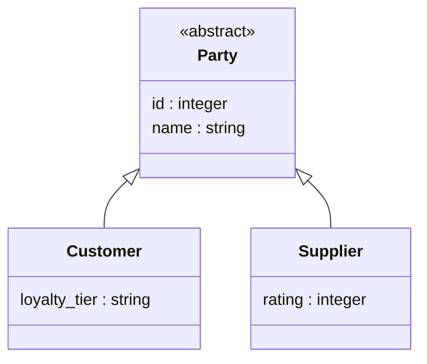
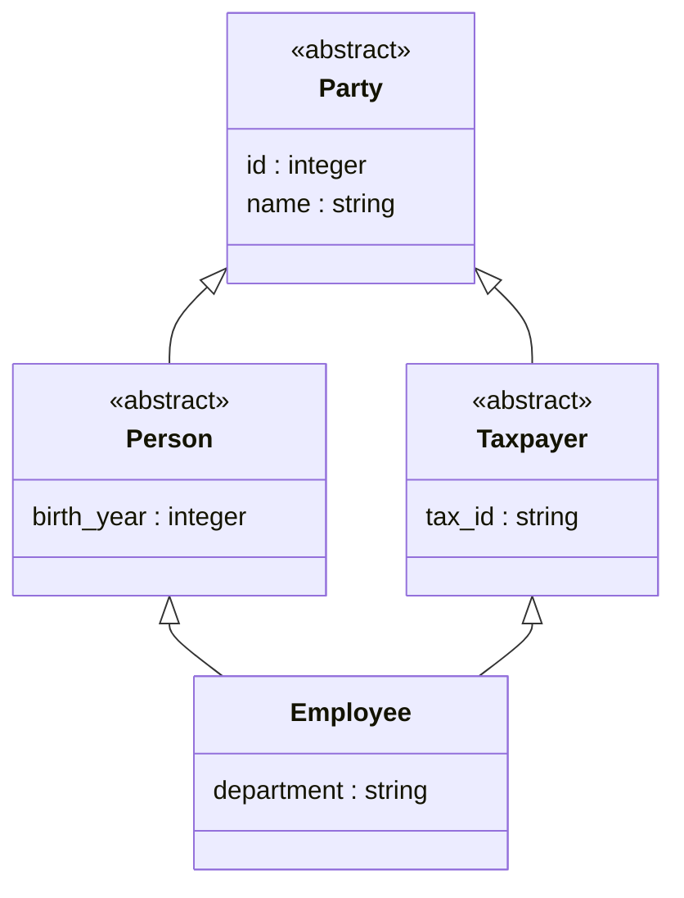

# Modeling class hierarchies

When several entities are kinds of one thing — a customer and a supplier are both
parties you deal with — you can declare the general kind once and say that each
specific kind `extends` it. A query written against the general kind then reaches
every specific kind. `extends` is the semantic model's *is-a*: a customer is a
party.

`kcmd push` expresses the hierarchy on the graph as **labels**. A subtype's node
table carries its own label plus one label per supertype, so `MATCH (:Party)`
matches every customer and every supplier, and each real party comes back once.

## What a hierarchy gives you, and what it does not

A hierarchy classifies **things**. It does not classify connections, storage, or
aggregates, and four rules mark that boundary. Read them before you model: each
one is enforced, and each one shapes the model you write.

- **Only entities inherit.** Relationships, metrics, actions, and constraints
  have no `extends`.
- **A supertype must be abstract.** Mark it `abstract: true`. It has no table and
  no rows of its own, and survives in the graph only as a label on its subtypes.
- **Both endpoints of a relationship must be a concrete entity.** An edge
  declared on an abstract supertype reaches no subtype and is dropped.
- **Each concrete subtype binds every field it exposes**, inherited fields
  included. A field the subtype does not bind is absent from the graph.

The first two rules are what make a supertype count exact. Because a supertype
has no table, no real thing can appear in two tables under the same label, so a
supertype query cannot double-count. The second two are the price: a hierarchy
buys you one query over many kinds, and it does not save you any binding work.

## 1. Declare the hierarchy

`Party` is the general kind. Every party is a customer or a supplier, so `Party`
has no table: it is `abstract: true`. Each concrete kind declares its own fields
and the one `extends` keyword.

```yaml
version: "0.2.0.dev0/google"
semantic_model:
  - name: parties
    entities:
      - name: Party
        abstract: true
        primary_key: [id]
        fields:
          - { name: id,   datatype: Integer }
          - { name: name, datatype: String }
      - name: Customer
        extends: [Party]
        primary_key: [id]          # each subtype keeps its OWN key; keys are not inherited
        fields:
          - { name: loyalty_tier, datatype: String }
      - name: Supplier
        extends: [Party]
        primary_key: [id]
        fields:
          - { name: rating, datatype: Integer }
```



The arrows are `extends`. `Party.id` and `Party.name` flatten down onto both
subtypes, so `Customer` and `Supplier` each expose them, and each subtype node
carries both its own label and the `Party` label.

This model names no tables. It is complete as a logical model, and binding it to
a graph is a separate step.

## 2. Bind each subtype's table

Every field a subtype exposes needs a column on that subtype's own table,
including the fields it inherited. `Party.name`, flattened onto `Customer`, is
read from the customer table, so `Customer` declares `name` again with the column
that backs it:

```yaml
      - name: Customer
        extends: [Party]
        primary_key: [id]
        source: my-project.sales.customer
        fields:
          - { name: id,           datatype: Integer, expression: c_custkey }
          - { name: name,         datatype: String,  expression: c_name }   # inherited from Party, bound here
          - { name: loyalty_tier, datatype: String,  expression: c_tier }
```

Redeclaring an inherited field is not a mistake and not a fallback — it is how a
binding reaches that field. A subtype that leaves an inherited field unbound
still inherits the name, but the push omits the property and warns:

```
entity 'Customer': field 'name' has no column under this binding; omitted from
the node table (bind it, or govern the logical model in Knowledge Catalog instead)
```

To bind the same hierarchy to more than one store, put each binding in its own
[profile](profiles.md). A profile answers the supertype query only for the
subtypes it binds: bind `Customer`, leave `Supplier` unbound, and `MATCH (:Party)`
returns customers alone.

## 3. Query the supertype

```
GRAPH my-project.sales.parties
MATCH (p:Party)
RETURN p.name
```

Every customer and every supplier comes back, each once, because each real party
lives in exactly one table.

The generated DDL shows how: each subtype table declares the `Party` label with
its own columns behind the shared property names.

```sql
`my-project.sales.customer` AS Customer
  KEY(c_custkey)
  DEFAULT LABEL
  PROPERTIES( c_custkey AS id, c_name AS name, c_tier AS loyalty_tier )
  LABEL Party
  PROPERTIES( c_custkey AS id, c_name AS name ),
`my-project.sales.supplier` AS Supplier
  KEY(s_suppkey)
  DEFAULT LABEL
  PROPERTIES( s_suppkey AS id, s_name AS name, s_rating AS rating )
  LABEL Party
  PROPERTIES( s_suppkey AS id, s_name AS name )
```

A shared label is reconciled by property name rather than by backing column, so
the two tables never have to agree on a column name — only on `id` and `name`.

## Deeper and wider hierarchies

`extends` composes. A subtype can extend several supertypes, and a supertype can
extend another supertype above it. Every intermediate level is abstract, so only
the leaves have tables.

```yaml
      - name: Party
        abstract: true
        primary_key: [id]
        fields:
          - { name: id,   datatype: Integer }
          - { name: name, datatype: String }
      - name: Person
        abstract: true
        extends: [Party]
        fields:
          - { name: birth_year, datatype: Integer }
      - name: Taxpayer
        abstract: true
        extends: [Party]
        fields:
          - { name: tax_id, datatype: String }
      - name: Employee
        extends: [Person, Taxpayer]
        primary_key: [id]
        source: my-project.hr.employee
        fields:
          - { name: id,         datatype: Integer, expression: e_id }
          - { name: name,       datatype: String,  expression: e_name }
          - { name: birth_year, datatype: Integer, expression: e_birth }
          - { name: tax_id,     datatype: String,  expression: e_tax }
          - { name: department, datatype: String,  expression: e_dept }
```



`Party` is reached through two paths, so this is a diamond. `Employee` carries
the `Person`, `Taxpayer`, and `Party` labels, and `Party` appears once.
`MATCH (:Person)`, `MATCH (:Taxpayer)`, and `MATCH (:Party)` each return every
employee a single time. Neither the number of supertypes nor the number of paths
to a shared ancestor changes the count.

Depth behaves the same way. `Party` can divide into abstract `Person` and
abstract `Organization`, with concrete `Customer` under one and concrete `Vendor`
under the other: `MATCH (:Party)` then returns every customer and every vendor,
`MATCH (:Person)` returns customers alone, and `MATCH (:Organization)` vendors
alone.

## Relationships in a hierarchy

An edge attaches to the concrete entity whose table holds the foreign key. It
does not flow down to subtypes, and it cannot be declared on a supertype.

Declaring `owns` from `Party` to `Account` deploys a graph with no `owns` edge at
all, because `Party` has no node table for the edge to reference. The push warns
and continues:

```
relationship 'owns': references skipped entity 'Party'; edge omitted
```

Declare the edge on each concrete kind that has the key instead, one edge per
kind, each with its own name:

```yaml
    relationships:
      - name: customerOwns
        from: Customer
        to: Account
        from_columns: [account_id]
        to_columns: [id]
      - name: supplierOwns
        from: Supplier
        to: Account
        from_columns: [account_id]
        to_columns: [id]
```

A query then names the kind it traverses from —
`MATCH (:Customer)-[:customerOwns]->(:Account)`. One traversal over every party
kind is not expressible today; see [Limitations](#limitations).

## Metrics in a hierarchy

A metric attaches to a concrete entity, and every concrete entity accepts one.
Because supertypes are abstract, no node table ever shares its label with
another, so the restriction that a measure must sit on a leaf type never applies
to a model built this way.

```yaml
    metrics:
      - name: total_spend
        expression: SUM(Customer.spend)
```

A metric that targets the abstract supertype is dropped, with the reason:

```
metric 'total_spend' targets entity 'Party', which is abstract (a table-less
supertype with no node table to carry a MEASURE); metric dropped
```

For a figure over the whole hierarchy, declare the metric once per concrete
subtype and combine the results in the query.

## Match the shape to how your data is stored

How your subtypes are already stored decides whether `extends` is the right tool.
It builds one layout directly; the other two common ones are modeled without it.

- **One table per kind, the parent has none.** Each concrete kind has its own
  complete table, and a supertype query is the union of those tables. This is the
  layout `extends` builds.
- **One table for the whole family, with a kind column.** All parties in one
  table, with a `type` column saying which kind each row is. Model this as one
  entity with a dimension field. It holds one row per thing, so it cannot
  double-count, but it gives you no per-kind label: `MATCH (:Customer)` is not
  available.
- **A base table plus an extension table.** A thing's general fields in one table
  and its specific fields in another, tied by a shared key. Model this as one
  entity whose binding joins the two tables, so the thing keeps one identity.

## Limitations

Each item below is current behavior. Where a workaround exists it is the
supported way to get the result today.

- **A supertype cannot have a table.** `abstract: true` is required on any entity
  another entity extends. A supertype with rows of its own would put the same
  real thing in two tables under one label, and a supertype count would include
  it twice. For a general table plus a specific table describing one thing, model
  one entity whose binding joins them.
- **Relationships do not inherit, and cannot start or end on a supertype.** There
  is no single edge that traverses every kind of party. Declare one edge per
  concrete kind, and write one query per kind. This is the largest gap in the
  feature today.
- **A metric cannot cover a whole hierarchy.** A metric lowers to a graph
  `MEASURE` on one node table, and an abstract supertype has none. Declare the
  metric per subtype and combine in the query.
- **Keys do not inherit.** Each concrete subtype declares its own `primary_key`.
- **Inherited fields are not free.** A concrete subtype must declare and bind
  every inherited field it wants in the graph. `extends` saves you the logical
  declaration in the supertype, and it saves nothing in the binding.
- **An inherited field cannot be given a different meaning.** Every table under a
  shared label must declare the property identically. A subtype may bind an
  inherited field to its own column, but it may not redefine what the field means
  or attach its own description to it.
- **A hierarchy where all kinds live in one table is not expressible.** A node
  table is a whole table, so a kind identified by a discriminator column has no
  label of its own. Model it as one entity with a dimension field.
- **Descriptions on a supertype reach nothing.** A supertype's `description` and
  synonyms are not emitted onto the shared label, and the catalog skips the
  supertype entirely, so they are visible only in the model file.
- **Knowledge Catalog does not see the hierarchy.** Abstract supertypes are
  skipped on a push there and no published entry records what it extends. Until
  the catalog gains a class-hierarchy construct, a hierarchy is a property of the
  deployed graph and of the model file.

## Where a hierarchy deploys

A hierarchy reaches BigQuery Graph and Spanner Graph. The extra labels and the
flattened fields are identical on both, so one model deploys to either. A Spanner
target carries no measures and no element descriptions, as it does for any model.

A hierarchy does not reach Knowledge Catalog. The catalog has no class-hierarchy
construct today, so a push there skips every abstract supertype and warns:

```
entity 'Party' is abstract (no physical table); skipped for Knowledge Catalog
(KC does not yet model class hierarchies)
```

The concrete subtypes are published as ordinary entries, and no entry records
what it extends. So the catalog sees `Customer` and `Supplier`, and it does not
see that both are parties. The hierarchy survives in the model file itself:
`kcmd pull` and the OSI serialization both carry `extends` and `abstract`, so a
round trip does not lose it.

The generation rules and the exact text of every error are in
[Reference → Class hierarchies](reference.md#class-hierarchies-extends--labels).
